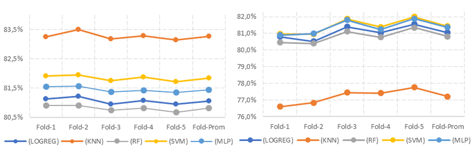

# Modelos para la predicción de la severidad de siniestros viales empleando algoritmos de clasificación basados en aprendizaje de máquina en la ciudad de Bogotá.

## Resumen 

La siniestralidad vial es una problemática de salud pública que genera más de un millón de muertes al año a nivel mundial, en el caso de la ciudad de Bogotá, Colombia, significó 536 fatalidades para el año 2022, razón por la cual es importante el estudio sistemático para entender la siniestralidad vial, así como de la severidad de estos eventos. Con el desarrollo de algoritmos programables de aprendizaje de máquina, se ha comenzado a emplear diferentes algoritmos para estudiar la ocurrencia de siniestros y su severidad desde un enfoque estadístico y de la ciencia de datos. Teniendo en cuenta lo anterior, la presente investigación tiene como objetivo la aplicación y comparación de modelos de clasificación supervisados como lo son, regresión logística (LOGREG), k vecinos cercanos (KNN), bosques aleatorios (RF), máquinas de soporte vectorial (SVM) y red neuronal multicapa (MLP) en la predicción de los niveles de severidad en los siniestros viales de la ciudad de Bogotá, comparando su desempeño en la estimación con diferentes métricas. Esta investigación permite identificar los algoritmos con mejor desempeño en la estimación y los hiperparámetros optimizados para los diferentes modelos, brindando un análisis riguroso de la siniestralidad y su severidad.

**Palabras Clave**: Modelos de Predicción de Severidad, Algoritmos de Aprendizaje de Máquina, Clasificador K vecinos Cercanos (KNN), Clasificador Máquinas de Soporte Vectorial (SVM), Red Neuronal Multicapa (MLP).

## 2.	Metodología y procedimientos

### 2.1.	Recolección y análisis de la información.
En el ámbito de este estudio se encuentran los diferentes tipos de actores involucrados en siniestros viales registrados en los formatos de los informes policiales de accidentes de tránsito (IPAT) en las bases de datos del Sistema Geográfico de Accidentes de Tránsito de Bogotá – SIGAT (Secretaría Distrital de Movilidad, 2022) para los años 2020 – 2022. Dicha información incluye datos de siniestralidad en los que se ven implicados automóviles, bicicletas, buses, busetas, camiones, camionetas, camperos, microbuses, motocicletas, motociclos, tractocamiones y volquetas. Se analizaron los datos a partir del 1 de octubre de 2020 puesto que una vez revisada la frecuencia de siniestros viales se evidenció que el comportamiento es similar a valores previos a la pandemia de COVID-19, es decir, valores o frecuencias estables, reflejando una estabilización en la siniestralidad, hasta el 9 de diciembre de 2022 cuando entra en vigor la Ley 2251 de 2022 con la cual se establecen las disposiciones normativas orientadas a la implementación de una política pública de seguridad vial enfocada en un sistema seguro, entre ellas la no obligatoriedad de registro de IPAT para siniestros clasificados como sólo daños. 

El análisis para determinar la severidad de la siniestralidad se realizó teniendo en cuenta las eventualidades que se pudieran presentar durante el siniestro 

*Gravedad de siniestro por actor vial en estudio.*
| **Gravedad** | **Descripción**   | **Frecuencia** | **Porcentaje** |
| ------------ | ----------------- | -------------- | -------------- |
| 0            | Fatalidades (FAT) | 2658           | 1.79%          |
| 1            | Heridos (HE)      | 64914          | 43.77%         |
| 2            | Solo daños (SD)   | 80742          | 54.44%         |
*Fuente:  elaboración propia.*

### 2.2.	Variables del modelo y tratamiento de la información

Para la ejecución del modelo se empleó información que pudiera ser relacionada a la ocurrencia del siniestro, es decir, elementos previos, ocurridos durante o asociados al siniestro, como el género y tipo de actor vial, variables que permitieran la implementación de algoritmos de aprendizaje automático, de manera que el modelo ejecutara o no la clasificación de la información. 
Se establecieron seis variables categóricas y tres variables continuas numéricas, de acuerdo al tratamiento de datos se obtuvieron 148.000 registros o siniestros, es relevante resaltar que se efectuó la limpieza de la información, es decir, limpieza de campos nulos, duplicados o que estuvieran vacíos, por lo que se realizó el reemplazo de los registros faltantes o atípicos, a fin de que el modelo se pudiera ejecutar sin ninguna dificultad.  
La variable respuesta fue la gravedad, factor determinante en el análisis de siniestros para la seguridad vial, por otro lado, se establecieron las variables explicativas, dando una aclaración al modelo, a partir de la información recopilada, siendo estas el actor vial, género, edad, la clase del siniestro, clase del vehículo, tipo de servicio del vehículo, el año del modelo de servicio y la causa probable del siniestro (ver Anexo 1).

### 2.3.	Pre procesamiento y validación cruzada

Con la finalidad de garantizar la consistencia de la base de datos se realizó la limpieza de los diferentes registros, para el caso del proyecto se identificaron los datos atípicos e inconsistentes para proceder a ser retirados de la base, teniendo en cuenta dicha limpieza originalmente de 158.838 registros quedaron 148.314 (retirando el 7% de los datos). Posteriormente, se efectúa el pre-procesamiento de las variables, para las variables categóricas se utilizó el algoritmo “OneHotEncoder” y para la variable continua (edad) se aplica “StandardScaler” de la librería “Sklearn” (Pedregosa et al., 2011). Después, con el propósito de tener agrupaciones para la prueba del modelo se separaron los conjuntos de entrenamiento a un 70% y prueba a un 30%, estratificado en función de la gravedad con el fin de garantizar una representación proporcional de dicha variable. Por otro lado, al momento de ejecutar el entrenamiento y prueba de los modelos, se aplicó el algoritmo de validación cruzada “k-folds” = 5 (valor seleccionado en función de los recursos informáticos), siendo este un algoritmo altamente utilizado debido a su alto desempeño en la aplicación de modelos de entrenamiento. 

### 2.4.	Algoritmos de aprendizaje automático

Esta investigación se centrará en la aplicación de algoritmos de clasificación supervisados de aprendizaje de máquina, los cuales han demostrado tener gran aplicabilidad en la estimación de los niveles de severidad desde un enfoque matemático. La regresión logística (LOGREG) es uno de los métodos más ampliamente utilizados en los estudios de severidad (referencias), de igual manera, algoritmos de clasificación K vecinos Cercanos (KNN) y Bosques Aleatorios (RF) (referencias), los cuales son metodologías de clasificación de amplia difusión que han demostrado tener muy buen desempeño y ajuste en ejercicios de clasificación. Como parte de la investigación también se emplearon algoritmos más robustos que han demostrado alta aplicabilidad en problemas complejos de clasificación como lo son las Máquinas de Soporte Vectorial (SVM) y Red Neuronal Multicapa (MLP).

Se utilizó el lenguaje y motor de análisis “Python” en versión 3.5, con las bibliotecas de ciencia de datos “Numpy” (Harris et al., 2020), “Pandas” (pandas development team, 2020) y “Scikit-learn” (Pedregosa et al., 2011), aplicando el algoritmo “GridSearchCV” para la optimización e identificación de los hiperparámetros de modelos.

### 2.5.	Métricas de desempeño.

Para analizar el desempeño de los modelos se emplearon las métricas para la evaluación de clasificadores supervisados, se contempló la exactitud “accuracy” como estimador general del modelo y para evaluar el desempeño de la validación cruzada, así como el error de entrenamiento y de generalización de los modelos con los hiperparámetros seleccionados para cada algoritmo como evaluación general de los algoritmos.

Para comparar el poder predictivo en los diferentes niveles de severidad, se empleó la matriz de contingencia en la predicción del conjunto de pruebas, de igual manera, se evaluaron los estimadores, Precisión promedio, Recuperación promedio y F1 Promedio, como estimadores de los falsos positivos y falsos negativos en los modelos para cada uno de los niveles de severidad.

## 3.	Resultados y discusión

Con la finalidad de poder estimar el desempeño de cada clasificador y obtener los hiperparámetros óptimos para cada uno de los modelos se aplicó el algoritmo “GridSearchCV” con una validación cruzada “K-folds” (K=5).
*Tabla 2: hiperparámetros óptimos para los algoritmos por clasificador.*
| **Algoritmos para clasificar siniestros.** | **Hiperparámetros**                                                                                 |
| ------------------------------------------ | --------------------------------------------------------------------------------------------------- |
| Regresión Logística (LOGREG)               | C: 10                                                                                               |
| K vecinos Cercanos (KNN)                   | n_neighbors: 3                                                                                      |
| Bosques Aleatorios (RF)                    | bootstrap: True; criterion: gini; max_depth: 4; max_features: sqrt; n_estimators: 500               |
| Máquinas de Soporte Vectorial (SVM)        | C: 10; gamma: 0,1                                                                                   |
| Red Neuronal Multicapa (MLP)               | activation: tanh; alpha: 0,05; hidden_layer: (50; 100; 50); learning_rate: invscaling; solver: adam |
*Fuente:  elaboración propia.*

Para comparar de manera objetiva el desempeño estimado en los diferentes modelos de cada clasificador, se presenta el resultado del desempeño promedio para el modelo con los hiperparámetros identificados, en la figura 1 se muestra el resultado de la validación cruzada en el conjunto de pruebas.

*Figura 1 a) Desempeño para CV k=5 Entrenamiento  	b)  Desempeño para CV k= 5 pruebas*

*Fuente:  elaboración propia.*

Al revisar la CV en el conjunto de entrenamiento (Figura 1a) la mayor exactitud se obtiene en el modelo KNN, sin embargo, para el caso de pruebas esta tendencia no se mantiene (Figura 1b), por su parte, los modelos LOGREG, RF, SVM Y MLP presentan un desempeño similar en el conjunto de pruebas de la validación cruzada con valores promedio cercanos al 81%, mientras el modelo KNN tiene un desempeño medio cercano al 77%, al evaluar la exactitud en los diferentes “folds”, los mejores resultados parecen estar en los relacionados con SVM y MLP.
Luego de haber identificado los modelos de mejor desempeño, se procede a evaluar el poder predictivo en el conjunto de entrenamiento completo y en el conjunto de pruebas (conjunto de generalización), la tabla 3 muestra los errores promedio de pruebas y generalización para los diferentes clasificadores.
Tabla 3: Errores de Entrenamiento y generalización.
| **Algoritmos para clasificar siniestros.**                                                                                                                                                                            | **Error entrenamiento** | **Error de generalización** | **Variación del error** |
| --------------------------------------------------------------------------------------------------------------------------------------------------------------------------------------------------------------------- | ----------------------- | --------------------------- | ----------------------- |
| Regresión Logística (LOGREG)                                                                                                                                                                                          | 18,962%                 | 19,002%                     | 0,040%                  |
| K vecinos Cercanos (KNN)                                                                                                                                                                                              | 17,019%                 | 22,618%                     | 5,599%                  |
| Bosques Aleatorios (RF)                                                                                                                                                                                               | 19,180%                 | 19,258%                     | 0,079%                  |
| Máquinas de Soporte Vectorial (SVM)                                                                                                                                                                                   | 18,199%                 | 18,674%                     | 0,475%                  |
| Red Neuronal Multicapa (MLP)                                                                                                                                                                                          | 18,793%                 | 18,935%                     | 0,141%                  |
| Error de entrenamiento: estimado a partir del conjunto de datos de entrenamiento del modelo.  Error de generalización: Estimado con los datos de pruebas y compuesto por datos no vistos durante el entrenamiento. |

Fuente:  elaboración propia

La tabla 3 muestra cómo los diferentes modelos empleados presentan errores cercanos al 20%, los cuales se encuentran dentro del margen de desempeño deseado para este tipo de modelos y con baja variabilidad entre el modelo de entrenamiento y el de generalización, siendo el KNN el único con una variación superior al 1% (5.60%), de los modelos evaluados el que presenta un menor error de generalización es el de MLP, no obstante, no resulta significativamente superior a los modelos SVM, LOGREG y RF, en ese orden; es importante tener en cuenta que estos últimos modelos requieren menos recursos para su estimación y son más sencillos de aplicar, obteniendo resultados muy similares.

## 4.	Conclusiones

### 4.1.	Limitaciones			

Las limitaciones del estudio están relacionadas con la disponibilidad y calidad de la información de los siniestros viales, así como la pérdida de información de los siniestros clasificados como solo daños por disposiciones normativas y con el formato de IPAT que no se encuentra actualizado y limita la información recopilada en los siniestros viales. Por lo anteriormente mencionado es preciso implementar alternativas tecnológicas para el diligenciamiento de los IPATs, además de un proceso riguroso de capacitación a las autoridades de tránsito en vía, con el fin de mejorar la calidad de la información recopilada, por otra parte, es necesario que desde el orden nacional se realice la actualización del formato de IPAT.

### 4.2.	Conclusiones
Los resultados de la aplicación de algoritmos de clasificación de aprendizaje de máquina presentaron una buena estimación para identificar los niveles de severidad en los siniestros viales registrados en la ciudad de Bogotá, Colombia. La exactitud promedio para el control de pruebas con los diferentes algoritmos estuvo por encima del 80%, siendo aceptable para todos los modelos aplicados. La investigación mostró que la aplicación de algoritmos más complejos de estimar como lo son SVM y MLP presentó levemente un mejor desempeño sin que este resultara ser mayormente significativo respecto a metodologías como LOGREG, RF, KNN, siendo cualquiera una herramienta deseable para la estimación de la severidad de los accidentes en la ciudad de Bogotá. De manera que, entidades encargadas de la gestión de la seguridad vial y profesionales pueden aplicar metodologías basadas en clasificadores para establecer medidas preventivas y correctivas en el estudio de la siniestralidad, de manera que, la implementación de enfoques basados en aprendizaje de máquina resulta ser pertinente en función de los resultados.
Al analizar los resultados de la predicción para cada uno de los niveles de severidad, se evidencia que los clasificadores resultan ser particularmente eficiente en la estimación de eventos con heridos y solo daños teniendo un alto rendimiento en las diferentes métricas de desempeño, mientras que para el caso de los siniestros con fatalidades, las técnicas empleadas no presentaban un buen rendimiento, siendo KNN la única capaz de representar de manera parcial los eventos con fatalidad, esto se puede dar debido a la diferencia tan alta en la cantidad de eventos con esta severidad, así como a la necesidad de incorporar otras variables que pudieran estar relacionadas con el siniestro como lo son las condiciones climáticas, las características de la vía, entre otras.
Así bien, la investigación muestra la pertinencia en la implementación de enfoques basados en aprendizaje de máquina en el estudio de la severidad en la siniestralidad en ciudades como Bogotá, donde la aplicación de algoritmos de clasificación tienen un desempeño deseable en la estimación de la severidad para la estimación de heridos y daños, mientras para el caso de las fatalidades es menos técnicas como KNN presentan resultados alentadores en la estimación de siniestros mortales que pueden ser implementados en el estudio sistemático de la siniestralidad.

### 4.3.	Investigaciones futuras

A partir de los resultados que demostró la investigación adelantada, se considera que los esfuerzos futuros deben centrarse en los siguientes aspectos: (1) establecer medidas preventivas y correctivas en el estudio de la siniestralidad. (2) plantear las bases para la formulación de análisis predictivos que permitan la formulación del sistema de alertas tempranas para la toma de decisiones en materia de seguridad vial. (3) identificación, captura y uso de información de conflictos viales.
